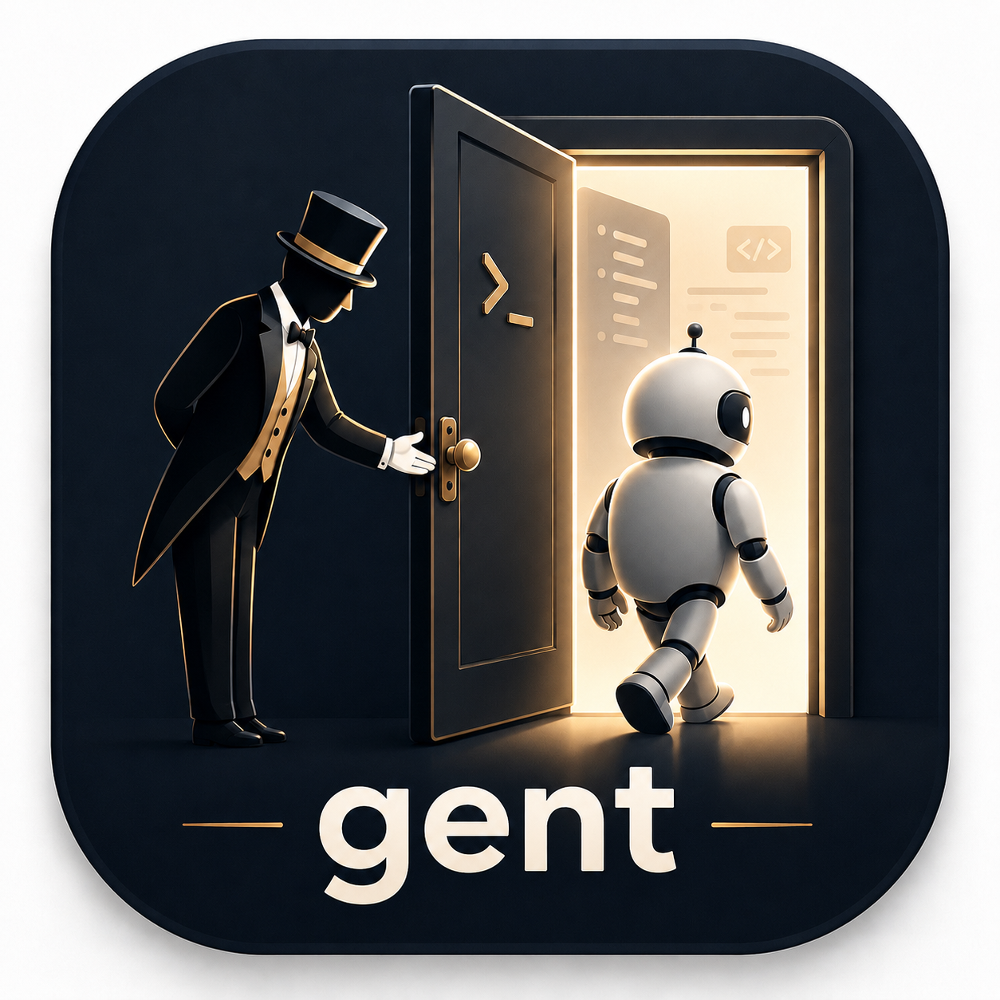

# gent



Coding-agent environment profile manager. Instead of loading every MCP server and skill on every session, `gent` helps you define named profiles that each activate only the tools relevant to your current task — then launches your agent with the right flags pre-composed.

It supports two agents: [Claude Code](https://claude.ai/code) (`claude`, the default) and [Pi](https://github.com/earendil-works/pi) (`pi`). A profile targets one of them via its `agent:` field, or you can override per-run with `--agent`.

```bash
gent dev           # launch claude with GitHub + fetch + memory, permissionMode: auto
gent pm            # launch claude with Linear + Jira + Notion + Slack + Confluence
gent dev,qa        # compose multiple profiles — union of their MCP servers/skills
gent               # interactive picker with multi-select and per-session MCP toggle
```

## Installation

```bash
git clone https://github.com/jorbraken/gent.git
cd gent
pnpm install
pnpm run global   # builds and links the CLI globally (npm link)
```

Requires Node.js ≥ 18 and [Claude Code](https://claude.ai/code).

## Quick start

```bash
# First-time setup — creates ~/.gent/config.yaml and your first profile
gent init

# List available profiles
gent list

# Run a profile
gent <profile>

# Preview the composed agent command without running it
gent <profile> --dry-run

# Pass extra flags through to the agent
gent dev -- -p "fix the failing tests"

# Run a profile against pi instead of claude (overrides the profile's agent)
gent dev --agent pi --dry-run
```

## Composing profiles

**CLI composition** — separate multiple profile names with commas to merge them on the fly:

```bash
gent dev,qa --dry-run    # union of dev + qa MCP servers, strict_mcp ORed, settings last-wins
```

**Interactive composition** — run `gent` with no args for a multi-select picker. After choosing profiles you get a second step to deselect individual MCP servers or skills for just this session.

**Static inheritance** — use `extends` in a profile YAML to inherit from another:

```yaml
# ~/.gent/profiles/dev-strict.yaml
extends: dev
settings:
  permissionMode: default   # override one field; rest inherited from dev
```

`extends` accepts a string or an array of parent names. Children always win over parents. Cycles are detected and rejected.

## Commands

| Command | Description |
|---|---|
| `gent [profile]` | Launch claude with a profile; interactive multi-select picker if omitted |
| `gent dev,qa` | Compose multiple profiles at runtime (comma-separated) |
| `gent list` | List all profiles |
| `gent init` | First-time setup wizard |
| `gent scaffold` | Create a project-local `.gent/` folder in the current directory |
| `gent profile show <name>` | Print a profile's configuration |
| `gent profile create [name]` | Create a new profile via wizard |
| `gent profile edit <name>` | Edit a profile interactively |
| `gent profile delete <name>` | Delete a profile |
| `gent mcp list` | List registered MCP servers |
| `gent mcp add` | Register a new MCP server |
| `gent mcp edit <name>` | Edit a registered MCP server |
| `gent mcp remove <name>` | Remove an MCP server |

## Configuration

Config lives in `~/.gent/` by default:

```
~/.gent/
├── config.yaml        # MCP server registry
├── profiles/
│   ├── dev.yaml
│   ├── pm.yaml
│   └── ...
└── skills/
    ├── my-skill/      # a directory containing SKILL.md, or a plugin-style bundle
    └── ...
```

### Project-local config

`gent` walks up from the current directory looking for a `.gent/` folder and uses it if found, otherwise it falls back to `~/.gent/`. This lets a repo carry its own profiles, MCP registry, and skills:

```bash
gent scaffold   # creates ./.gent/{config.yaml,profiles/,skills/} in the current dir
```

Any `gent` command run from within that directory tree (or a subdirectory) automatically uses the project-local `.gent/`.

### MCP server registry (`~/.gent/config.yaml`)

Define the full catalog of available servers once. Profile `env` values support `${VAR}` interpolation from your shell environment.

```yaml
mcp_servers:
  github:
    type: stdio
    command: npx
    args: ["-y", "@modelcontextprotocol/server-github"]
    env:
      GITHUB_PERSONAL_ACCESS_TOKEN: "${GITHUB_PERSONAL_ACCESS_TOKEN}"

  playwright:
    type: stdio
    command: npx
    args: ["-y", "@playwright/mcp@latest", "--headless"]
```

### Profile format (`~/.gent/profiles/<name>.yaml`)

```yaml
name: dev                  # optional — filename always wins
agent: claude              # optional: claude (default) or pi
extends: base              # optional: inherit from one or more parent profiles
description: Implementation — coding, code review, debugging
mcp:
  - github       # references keys in config.yaml
  - fetch
  - memory
strict_mcp: true           # pass --strict-mcp-config so only declared servers load
skills:
  - dev-tools              # references a directory in <gent-dir>/skills/
settings:
  model: claude-sonnet-4-6
  permissionMode: auto     # auto | default | bypassPermissions
  effortLevel: high
system_prompt_append: |
  Focus on clean, well-tested code.
```

The filename (`dev.yaml`) is always the profile name — the `name` field inside the YAML is ignored.

### Agents (claude vs pi)

A profile runs against `claude` by default. Set `agent: pi` (or pass `--agent pi`) to target Pi instead. `gent` translates the overlapping profile features into each agent's flags:

| Profile feature | claude | pi |
|---|---|---|
| `settings.model` | `--settings {model}` | `--model` |
| `settings.effortLevel` | `--settings {effortLevel}` | `--thinking` |
| `system_prompt_append` | `--append-system-prompt-file` | `--append-system-prompt` |
| `skills` | `--plugin-dir` | `--skill` |
| `mcp` / `strict_mcp` | `--mcp-config` / `--strict-mcp-config` | *not supported — ignored with a warning* |
| `settings.permissionMode` and other keys | `--settings` | *not supported — ignored with a warning* |

Pi has no MCP support, so when a `pi` profile lists MCP servers (or other unsupported settings) `gent` prints a yellow warning and skips them. The `gent profile create/edit` wizard is agent-aware: pick the agent up front and it offers the right model/thinking choices and hides the MCP prompts for `pi`.

### Skills

Each entry under `skills:` references a directory inside `<gent-dir>/skills/`. `gent` loads them via `claude --plugin-dir`:

- A directory containing a `skills/` subdirectory is treated as a **plugin-style bundle** and passed straight through as a `--plugin-dir`.
- A directory with a `SKILL.md` at its root is an **individual skill**; `gent` aggregates all such skills into a single temporary plugin (via symlinks) and loads that.

### Security

`gent` never passes MCP config, settings, or the system-prompt append as inline command-line arguments — those would be visible to any user via `ps`. Instead it writes them to temp files with mode `0600` and passes the file paths (for claude: `--mcp-config`, `--settings`, `--append-system-prompt-file`; for pi: `--append-system-prompt` with a file path). The temp directory is removed when the agent exits.

## Built-in SDLC profiles

Run `gent init` and choose from these or create your own:

| Profile | Phase | MCP servers |
|---|---|---|
| `pm` | Requirements | github, linear, jira, confluence, notion, slack, fetch |
| `designer` | Design | figma, github, notion, fetch |
| `dev` | Implementation | github, fetch, memory |
| `qa` | Testing | playwright, github, sentry, fetch |
| `sre` | Deployment | github, kubernetes, fetch |
| `ops` | Maintenance | github, sentry, datadog, fetch |

Each profile uses `--strict-mcp-config` so only its declared servers load. Set the relevant env vars (`GITHUB_PERSONAL_ACCESS_TOKEN`, `LINEAR_API_TOKEN`, `FIGMA_API_KEY`, etc.) in your shell.

## License

MIT © [jorbraken](https://github.com/jorbraken)
